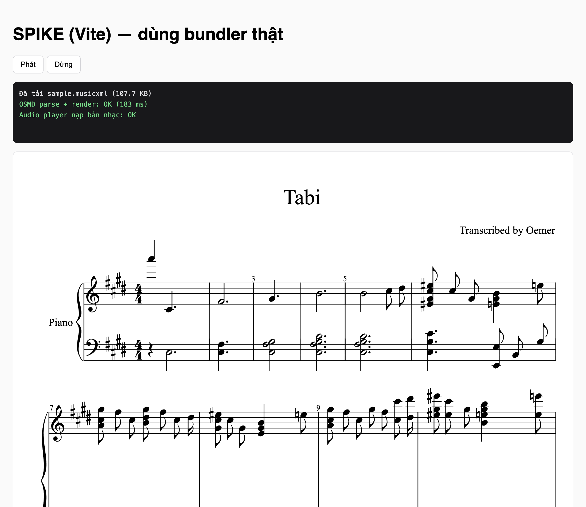

# Kết quả SPIKE: OSMD + Audio Player với MusicXML thật của oemer

- **Thời gian**: 2026-07-25 23:58
- **Giai đoạn PDCA**: DO → CHECK (Chu kỳ 1, hạng mục rủi ro cao nhất)
- **Câu hỏi cần trả lời**: Trình duyệt có hiển thị và **phát được** file `.musicxml` do chính oemer sinh ra không?

## KẾT LUẬN: ✅ ĐẠT

Cả hiển thị lẫn phát nhạc **đều chạy**. Rủi ro số 1 của kế hoạch đã được gỡ bỏ. **Không cần** dùng phương án dự phòng (server render MIDI→MP3).

## Cách kiểm chứng

Chạy pipeline oemer thật trên `figures/tabi.jpg` → thu được `tabi.musicxml` (107,7 KB) → nạp vào trang web bằng OSMD + audio player.

### Số đo thực tế

| Hạng mục | Kết quả |
|---|---|
| Thời gian transcribe (CPU, Apple Silicon) | **4 phút 07 giây** (331% CPU) |
| Kích thước MusicXML sinh ra | 107,7 KB |
| OSMD parse + render | ✅ **183 ms** |
| Audio player nạp bản nhạc | ✅ OK |
| SVG kết quả | 1049 × 2104 px, 1669 nhóm phần tử |
| Soundfont tự nạp | `acoustic_grand_piano` (MusyngKite) — player **tự nhận đúng nhạc cụ Piano** từ bản nhạc |

Bản nhạc hiển thị đúng tiêu đề *"Tabi"*, ghi chú *"Transcribed by Oemer"*, khuông kép piano, hoá biểu 4 dấu thăng, nhịp 4/4.

## Bài học quan trọng: chọn sai cách đóng gói sẽ ra kết luận sai

Tôi thử **2 cách**, và chúng cho **kết quả trái ngược nhau**:

| Cách | OSMD render | Audio player |
|---|---|---|
| CDN không build (`esm.sh`, `<script type=module>`) | ✅ OK (222 ms) | ❌ `g.instrument is not a function` |
| **Bundler thật (Vite + npm)** | ✅ OK (183 ms) | ✅ **OK** |

Nguyên nhân: `esm.sh` gói OSMD dạng CJS nên `OpenSheetMusicDisplay` nằm trong `default` chứ không phải named export, và dependency `soundfont-player` bên trong player cũng bị hỏng interop tương tự.

⇒ **Nếu chỉ thử bằng CDN, tôi đã kết luận nhầm là "không tương thích" và chuyển sang phương án dự phòng phức tạp hơn một cách vô ích.** Sản phẩm thật dùng Next.js (có bundler) nên bài test bằng bundler mới là bài test đúng.

## Về lo ngại lệch phiên bản (đã hoá giải)

Trước SPIKE tôi cảnh báo rủi ro cao vì lệch major:
- OSMD mới nhất: **2.1.0**
- `@isamu/osmd-audio-player@1.0.0` yêu cầu OSMD **^1.9.7** (lệch 1 major)
- `osmd-audio-player` (bản gốc jimutt) yêu cầu OSMD **^0.8.4** (lệch 3 major, đã ngừng phát triển)

**Cấu hình đã kiểm chứng chạy tốt**: `opensheetmusicdisplay@1.9.7` + `@isamu/osmd-audio-player@1.0.0`.

⇒ **Ghim đúng 2 phiên bản này.** Chưa nâng OSMD lên 2.1.0 cho tới khi có bài test chứng minh player vẫn chạy.

## Phát sinh cần xử lý ở Chu kỳ 2

1. **Soundfont tải từ `gleitz.github.io`** (GitHub Pages của một cá nhân) — phụ thuộc bên thứ ba không kiểm soát được. Production phải **tự host soundfont**.
2. `npm audit` báo **9 lỗ hổng (8 high, 1 critical)** trong cây phụ thuộc của spike. Cần rà lại trước khi lên production.

## Liên quan
- Kế hoạch: `plans/20260725_2327-pdca-frontend-oemer-web.md`
- Mã nguồn SPIKE: `web/spike-vite/` (bản Vite, **kết quả có giá trị**) và `web/spike/` (bản CDN, giữ lại làm đối chứng)
- Rào cản môi trường gặp phải: `reports/20260725_2358-loi-moi-truong-opencv5.md`
