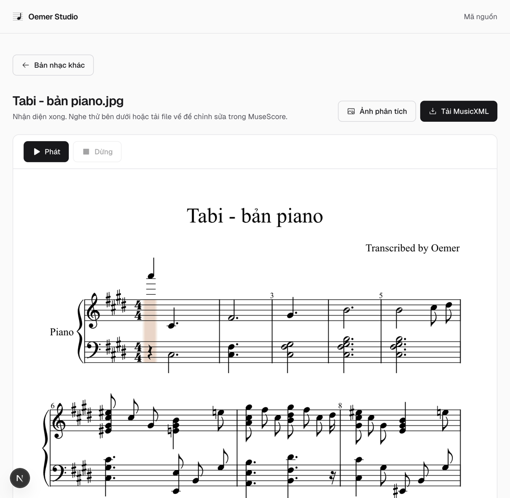
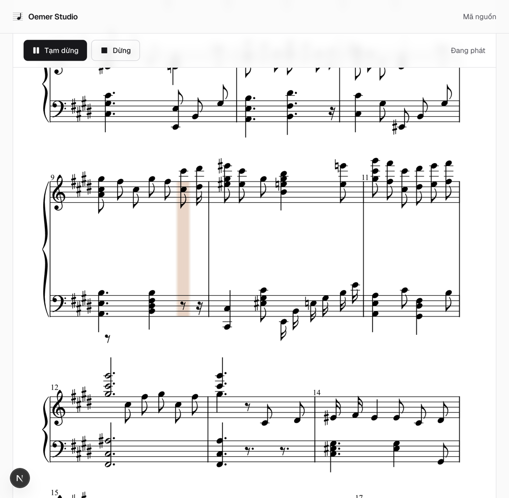
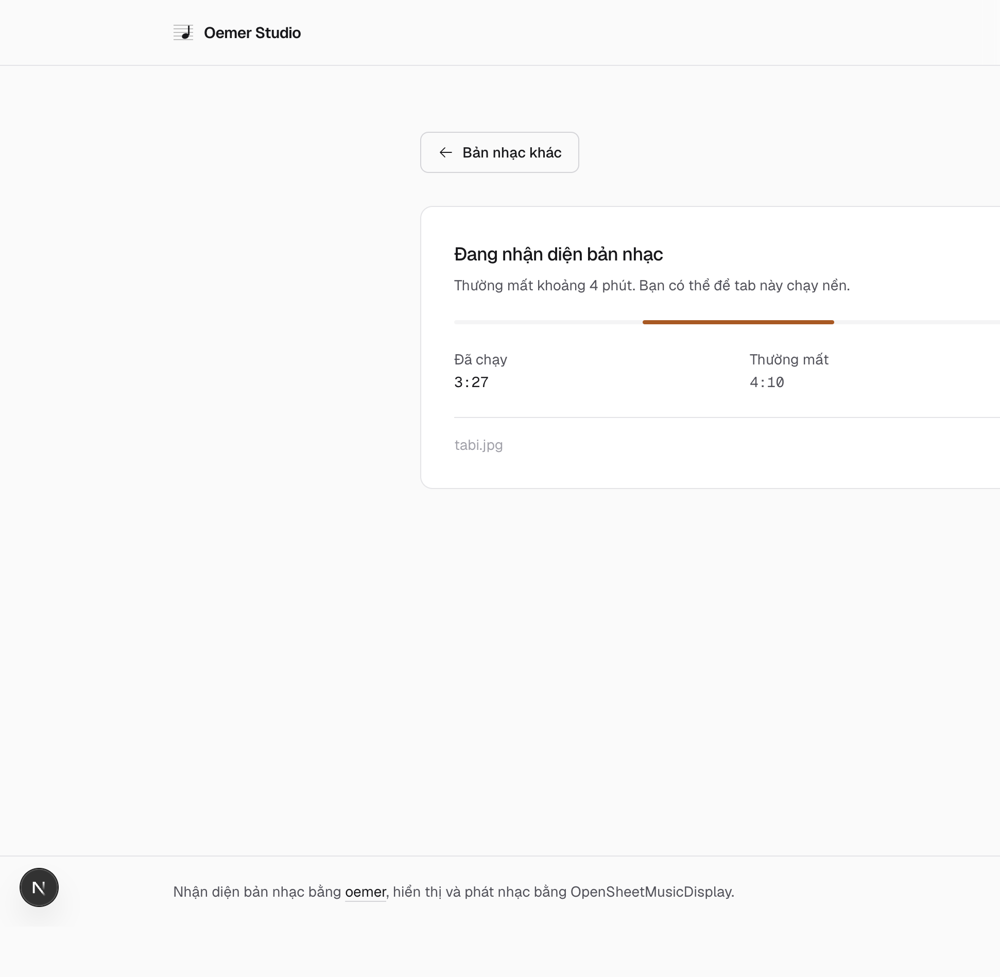
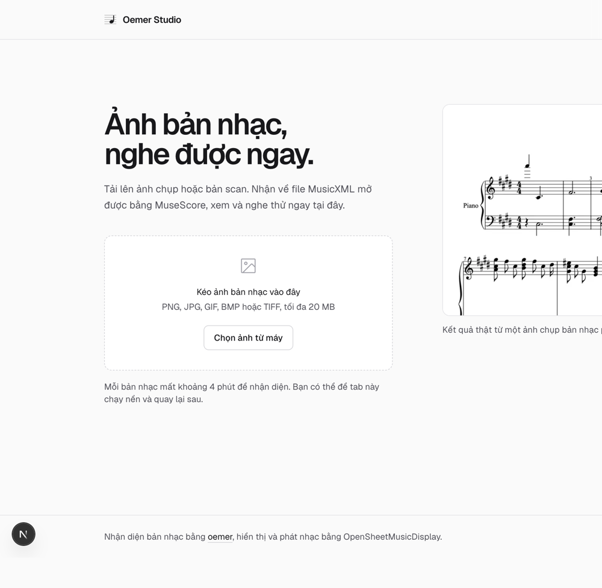

# Frontend MVP: đã chạy end-to-end, kèm 4 lỗi phát hiện khi kiểm thử

- **Thời gian**: 2026-07-26 00:59
- **Giai đoạn PDCA**: DO → CHECK (Chu kỳ 1, hạng mục cuối)
- **Câu hỏi cần trả lời**: Người dùng có thể tải ảnh lên, chờ, xem bản nhạc và **nghe** được nó ngay trên trình duyệt không?

## KẾT LUẬN: ✅ ĐẠT

Toàn bộ luồng chạy thật với backend thật: upload → hàng đợi → theo dõi tiến độ → hiển thị bản nhạc → **bấm Phát ra tiếng** → tải MusicXML về.

Con trỏ hổ phách đánh dấu vị trí đang phát, trải hết hai khuông piano; nốt nhạc vẫn đọc xuyên qua được nhờ chế độ hoà trộn nhân. Trang tự cuộn theo con trỏ:

Màn hình chờ và trang chủ:

| Đang chờ | Trang chủ |
|---|---|
|  |  |

## Đã dựng những gì

| Thành phần | File | Vai trò |
|---|---|---|
| Trang chủ | `web/app/page.tsx` | Giới thiệu + khung kéo thả |
| Khung kéo thả | `web/components/upload-dropzone.tsx` | Chọn/kéo ảnh, kiểm tra định dạng và dung lượng ngay tại máy |
| Trang job | `web/components/job-view.tsx` | Hỏi trạng thái mỗi 2 giây, hiện thời gian đã chạy |
| Trang kết quả | `web/components/score-result.tsx` | Tiêu đề, nút tải, ảnh phân tích |
| Khung xem nhạc | `web/components/score-viewer.tsx` | OSMD render + trình phát, thanh Phát/Tạm dừng/Dừng |
| Lớp gọi API | `web/lib/api.ts` | Bọc lỗi mạng thành câu tiếng Việt |

**Hệ thiết kế**: nền sáng, trung tính zinc, một màu nhấn hổ phách duy nhất dành riêng cho trạng thái đang chạy và con trỏ phát nhạc. Bản nhạc luôn nằm trên nền giấy trắng kể cả ở chế độ tối, vì bản nhạc là tài liệu chứ không phải bề mặt giao diện.

## Số đo

| Hạng mục | Kết quả |
|---|---|
| Transcribe 1 ảnh (đo lại lần này) | **3 phút 57 giây** |
| Trang chủ biên dịch lần đầu (dev) | 3,0 giây |
| Kiểm tra kiểu + lint | Sạch, 0 cảnh báo |
| Build production | Đạt, 2,2 giây |
| Test backend | 11/11 đạt |

## 7 lỗi chỉ lộ ra khi chạy thật

### 1. Tiêu đề bản nhạc bị thay bằng mã job ⚠️ lỗi thật, đã sửa

Backend lưu ảnh thành `{job_id}.jpg`, mà oemer lấy **tên file làm tiêu đề bản nhạc**. Kết quả: bản nhạc hiện tiêu đề `B9bfacad5bf1462da67d694e8860fa42` thay vì tên bài.

Sửa tại gốc: lưu ảnh vào `uploads/{job_id}/{tên gốc}` để giữ nguyên tên người dùng đặt.

Kèm theo đó là một rủi ro bảo mật: tên file do client gửi lên nay được dùng làm đường dẫn thật. Đã thêm `_safe_name()` cắt bỏ mọi thành phần thư mục và ký tự lạ, có test riêng (`server/tests/test_uploads.py`) khẳng định `../../etc/passwd` không thể thoát ra khỏi thư mục job.

### 2. Lỗi mất mạng bị báo nhầm thành "không nhận diện được" ⚠️ đã sửa

Khi không gọi được API, trang job hiện đúng dòng chữ dành cho trường hợp nhận diện thất bại. Người dùng sẽ tưởng bản nhạc của mình hỏng, trong khi thực ra nó vẫn đang chạy bình thường.

Đã tách hai trường hợp. Lỗi kết nối nay nói rõ: *"Bản nhạc của bạn vẫn đang được xử lý. Đang tự thử lại, bạn không cần tải lại trang."*

Đồng thời chuỗi `Failed to fetch` của trình duyệt đã được bọc lại thành tiếng Việt ngay ở `lib/api.ts`.

### 3. Comment mô tả sai việc code làm

Khối CSS cho con trỏ phát nhạc có comment ghi *"tô màu con trỏ theo màu nhấn"* nhưng code chỉ đặt `mix-blend-mode` chứ không tô màu gì. Nay màu được đặt đúng chỗ bằng `cursorsOptions` của OSMD, và comment nói đúng việc CSS thật sự làm.

### 4. Con trỏ phát nhạc vô hình — ba nguyên nhân chồng lên nhau ⚠️ đã sửa

Đây là lỗi tốn công nhất, vì có tới **ba** nguyên nhân độc lập cùng che một triệu chứng.

| # | Nguyên nhân | Vì sao |
|---|---|---|
| 1 | Con trỏ chưa được gọi hiện | Trình phát có gọi `cursor.show()`, nhưng phải `reset()` rồi `show()` sau khi render thì OSMD mới dựng ảnh con trỏ |
| 2 | Cao đúng **1 pixel** | OSMD kéo giãn ảnh cao 1px bằng **thuộc tính HTML** `height="120"`, nhưng preflight của Tailwind đặt `height: auto` cho **mọi** ảnh, ép nó về đúng chiều cao gốc |
| 3 | Nằm **sau** nền giấy | OSMD đặt `z-index: -1` bằng style inline, giả định phía sau không có gì. Nền trắng `.paper` của tôi nuốt mất nó |

Cách sửa: `z-index` ép bằng `!important` (style inline chỉ thua `!important`); chiều cao **không thể** sửa bằng CSS vì CSS không đọc được thuộc tính HTML, nên được sao chép sang style inline bằng một `MutationObserver` nhỏ.

### 5. Con trỏ hiện ra rồi… đứng yên khi phát ⚠️ đã sửa

Sau khi con trỏ hiện được, nó vẫn không nhúc nhích dù nhạc đang chạy. Thủ phạm là tuỳ chọn `autoResize: true`: OSMD **dựng lại** đối tượng con trỏ mỗi lần bố cục đổi, trong khi trình phát vẫn giữ tham chiếu tới con trỏ **cũ đã bị bỏ**. Nó vẫn cần mẫn đẩy con trỏ cũ đi, còn con trỏ hiển thị thì bất động — **không có lỗi nào được báo ra**.

Đã tắt `autoResize`. Đánh đổi: bản nhạc không tự dàn lại khi đổi kích thước cửa sổ, mà cuộn ngang. Đã ghi chú ngay trong code để người sau không bật lại.

Đây cũng là lý do `MutationObserver` ở lỗi số 4 phải theo dõi **cả vùng chứa** chứ không riêng phần tử con trỏ: bám vào một phần tử sẽ mất tác dụng ngay khi phần tử đó bị thay.

### 6. Không bấm được Tạm dừng khi đang nghe ⚠️ đã sửa

Trang tự cuộn theo con trỏ (đúng như thiết kế), nhưng thanh Phát/Tạm dừng nằm trên cùng nên trôi khỏi màn hình. Người dùng **không có cách nào dừng nhạc** ngoài việc cuộn ngược lên.

Đã ghim thanh điều khiển bám ngay dưới header. Kèm theo phải bỏ `overflow-hidden` ở panel bao ngoài, vì nó vô hiệu hoá `position: sticky`.

### 7. `.gitignore` bị nối chuỗi hỏng

Dòng 35 là `/clef_*server/data/` — lần sửa trước đã dán thêm vào cuối dòng cũ mà thiếu ký tự xuống dòng, khiến **cả hai quy tắc đều mất tác dụng**. Hậu quả: `server/data/` (chứa ảnh upload và database) không hề được loại trừ khỏi git. Đã tách lại thành hai dòng.

## Quyết định thiết kế đáng ghi lại

**Không bịa phần trăm tiến độ.** Pipeline oemer không báo được nó đang ở bước nào, nên mọi con số phần trăm hiển thị ra đều là bịa. Thay vào đó màn hình chờ hiện: thanh chạy bất định (chỉ để báo còn sống), **thời gian đã chạy thật**, và **mức thường gặp là 4:10** để người dùng tự đối chiếu. Trung thực và vẫn đủ thông tin.

**Nút gửi chỉ xuất hiện khi đã chọn ảnh.** Ban đầu nút "Bắt đầu nhận diện" luôn hiện ở trạng thái mờ. Ở chế độ tối nó thành một khối xám to nằm chình ình, vừa xấu vừa vô nghĩa. Bỏ đi thì khung kéo thả trở thành hành động chính rõ ràng.

**Logo phải có nốt nhạc.** Bản đầu vẽ 5 vạch kẻ khuông, nhưng ở kích thước 20px nó trông **y hệt icon menu hamburger**. Thêm một nốt nhạc là hết nhầm.

## Vướng mắc môi trường (không phải lỗi dự án)

Cổng 3000 và 3100 trên máy này đã bị tiến trình Cursor chiếm để chuyển tiếp cổng, nên Next.js bind vào đó thì mọi request đều bị trả về rỗng. Đã chuyển sang cổng 4321 để kiểm thử. Mặc định trong code vẫn giữ 3000 vì đó là cổng chuẩn của Next.js, đây chỉ là đặc thù máy.

## Bài học rút ra

**Ba lỗi nặng nhất đều thuộc loại im lặng.** Tiêu đề sai, con trỏ đứng yên, lỗi mạng báo nhầm — không cái nào ném exception, không cái nào hiện trong log, và **cả ba đều lọt qua kiểm tra kiểu lẫn lint**. Chúng chỉ lộ ra khi nhìn vào màn hình thật với dữ liệu thật. Kiểm thử bằng cách đọc code sẽ không bắt được cái nào.

**Thư viện giao diện và thư viện vẽ nhạc tranh chấp âm thầm.** Preflight của Tailwind đặt `height: auto` cho mọi ảnh — hoàn toàn hợp lý với ảnh thường, nhưng phá đúng cơ chế OSMD dùng để kéo giãn con trỏ. Không có cảnh báo nào; con trỏ chỉ đơn giản là biến mất.

## Còn nợ lại

1. **Chưa kiểm thử được thao tác chọn file thật** bằng trình duyệt tự động (công cụ chặn thao tác với ô chọn file). Đã kiểm thử gián tiếp bằng cách gọi API và mở thẳng trang job. Cần một lần thử tay.
2. **Soundfont vẫn tải từ `gleitz.github.io`** — phụ thuộc bên thứ ba, phải tự host trước khi lên production.
3. **Ảnh phân tích nặng ~4 MB**, chưa nén.
4. **Chưa có Dockerfile** bake sẵn checkpoint.

## Liên quan
- Kế hoạch: `../plans/20260725_2327-pdca-frontend-oemer-web.md`
- Backend: `../reports/20260726_0024-backend-mvp-va-test-dong-thoi.md`
- SPIKE gốc: `../reports/20260725_2358-ket-qua-spike-osmd-playback.md`
