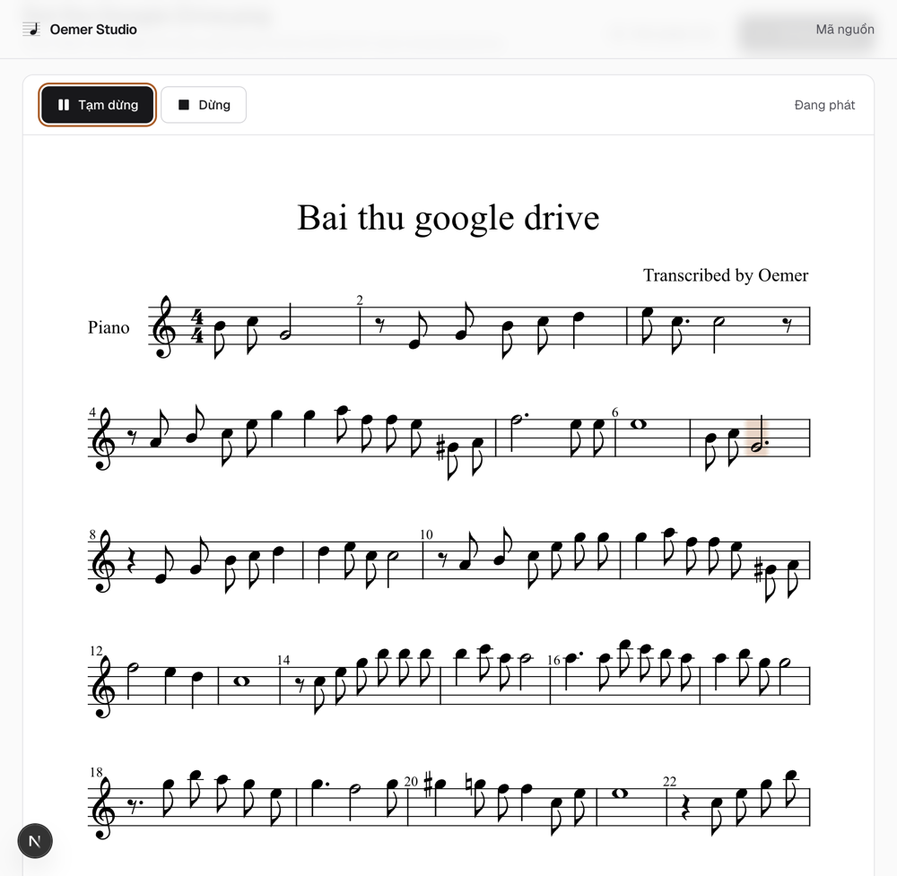
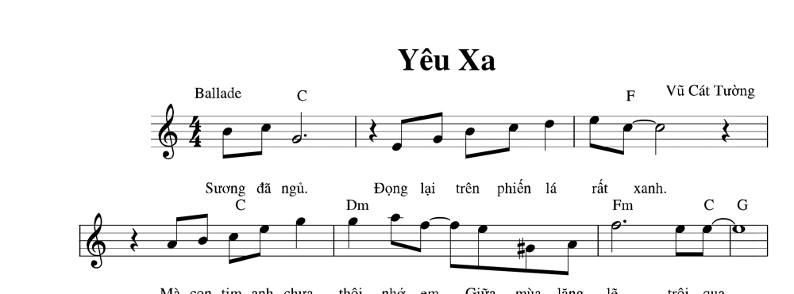
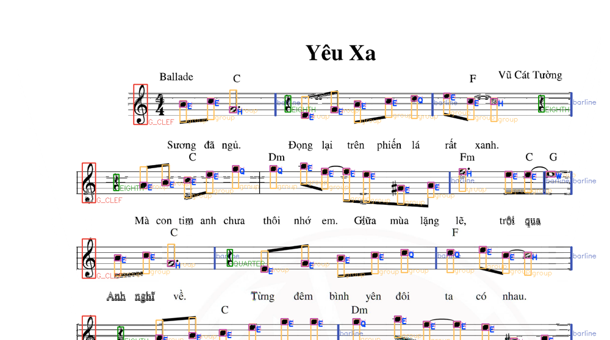

# Thử thực tế: PDF *Yêu Xa* (Vũ Cát Tường) qua Oemer Studio

- **Thời gian**: 2026-07-26 01:31
- **Giai đoạn PDCA**: CHECK — bài ngoài tập mẫu, do người dùng cung cấp
- **Nguồn**: [Google Drive](https://drive.google.com/file/d/13Ld-lqEXXRE6uyZFQd7nRbIJbNzCqKUd/view)

## KẾT LUẬN

Pipeline **chạy xong và nghe được**. Giai điệu mở đầu khớp gốc. Lead sheet có lời + hợp âm + watermark thì oemer **chỉ lấy được nốt**, bỏ hết chữ và hợp âm — đúng giới hạn của OMR thuần, không phải lỗi hệ thống.

## Đầu vào

| Thuộc tính | Giá trị |
|---|---|
| Định dạng gốc | **PDF** 1 trang (API chưa nhận PDF) |
| Đã chuyển | PNG 300 dpi, 2480 × 3508, ~960 KB (`pdftoppm`) |
| Tác phẩm | *Yêu Xa* — Vũ Cát Tường |
| Kiểu bản nhạc | Lead sheet 1 khuông: giai điệu + lời + hợp âm (C, Dm, Fm…) |
| Nhiễu | Watermark giữa trang, font chữ dày |

## Số đo

| Hạng mục | Kết quả |
|---|---|
| Job ID | `e230724de17f46278338395687f0b275` |
| Thời gian nhận diện | **4 phút 29 giây** (01:26:16 → 01:30:45 UTC) |
| MusicXML | 39 KB, 29 ô nhịp, 138 nốt, 10 nghỉ |
| Lời / hợp âm trong XML | **0 / 0** |
| Hiển thị OSMD | ✅ |
| Bấm Phát | ✅ (trạng thái "Đang phát", con trỏ chạy) |

## Đối chiếu giai điệu 3 ô đầu

| Ô | Gốc (đọc bằng mắt) | Oemer |
|---|---|---|
| 1 | B4 C5 G4 | B4 C5 G4 ✅ |
| 2 | nghỉ · E4 G4 B4 C5 D5 | nghỉ · E4 G4 B4 C5 D5 ✅ |
| 3 | E5 C5 C5 · nghỉ | E5 C5 C5 · nghỉ ✅ |

Ba ô mở đầu **khớp cao độ**. Trường độ từng nốt có lệch (ví dụ ô 1: gốc gần với hai nốt ngắn + một nốt dài; oemer ghi `eighth + eighth + half` — tổng 3 beat trong nhịp 4/4, thiếu 1 beat so với bản gốc nếu G là nửa chấm).

## Những gì oemer **không** làm (và không nên kỳ vọng)

1. **Lời bài hát** — không OCR; `<lyric>` = 0.
2. **Ký hiệu hợp âm** (C, Dm, Fm, A7…) — không có `<harmony>`.
3. **Tiêu đề / tác giả trên ảnh** — tiêu đề lấy từ **tên file** (`Bai thu google drive`), không đọc chữ "Yêu Xa" / "Vũ Cát Tường".
4. **Nhịp độ chữ** ("Ballade") — bỏ qua.
5. **PDF** — API chỉ nhận ảnh; phải chuyển bằng `pdftoppm` trước.

Đây là giới hạn của mô hình OMR (nhận dạng ký hiệu nhạc), không phải lỗi hàng đợi hay frontend.

## Phát hiện sản phẩm cần ghi lại

1. **API chưa nhận PDF.** Người dùng gửi link Drive thường là PDF scan. Chu kỳ 2 nên: hoặc nhận PDF và rasterize phía server, hoặc từ chối rõ ràng với hướng dẫn chuyển sang PNG/JPG.
2. **Lead sheet ≠ bản piano.** MVP đã chứng minh với bản piano 2 khuông; bài này cho thấy lead sheet 1 khuông vẫn chạy, nhưng sản phẩm nghe được **chỉ là giai điệu** — mất lời và hợp âm nên trải nghiệm "nghe bài hát" kém hơn nhiều so với kỳ vọng người dùng phổ thông.
3. **Watermark không chặn pipeline**, nhưng có thể góp phần làm lệch trường độ / nốt lẻ ở giữa trang.

## Liên quan
- Frontend MVP: `20260726_0059-frontend-mvp-va-loi-phat-hien.md`
- Job xem lại: http://localhost:4321/jobs/e230724de17f46278338395687f0b275
